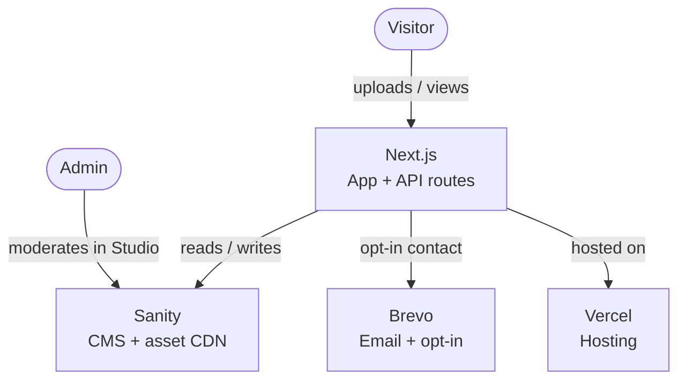
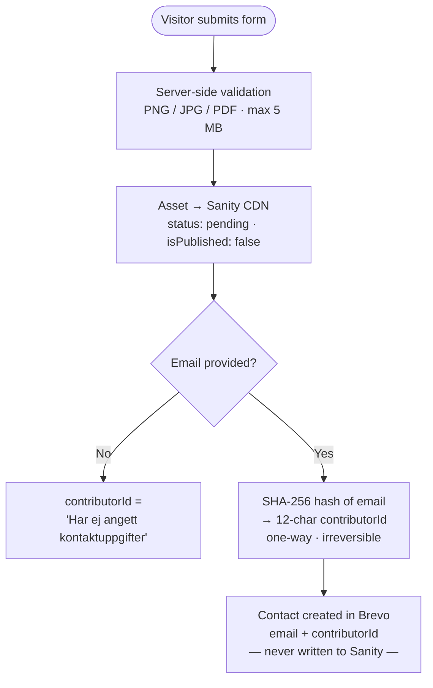
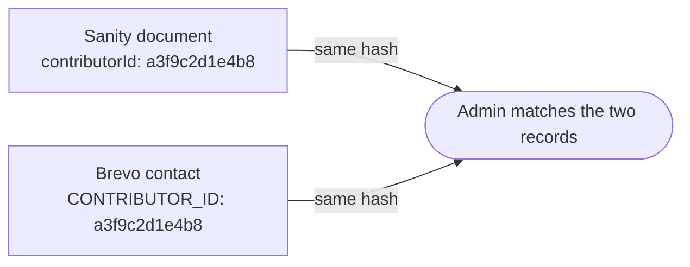

# Campaign Platform for Anonymous User Upload

A JAMstack campaign platform initially built for an organisation running a mobile poster print shop ahead of the 2026 Swedish elections. The platform lets anonymous visitors submit poster motives for review and potential publication, subscribe to a newsletter, and browse upcoming events. Admins manage submissions and content through Sanity Studio.

---

## What makes this repository different

Most Next.js + Sanity projects are straightforward content sites. This one has a specific set of constraints that shaped every architectural decision:

**Anonymous contributions by design.** Visitors upload poster motives without creating an account. No authentication, no tracking, and the lowest possible barrier to participation.

**Personal data never enters Sanity.** If a visitor provides an email address (entirely optional), it is sent directly to Brevo via an API route and never written to the CMS. This is a deliberate GDPR decision, not an oversight. Sanity holds zero PII.

**Pseudonymised contributor tracking.** The only link between a Sanity submission and a Brevo contact is a 12-character SHA-256 hash of the email address (`contributorId`). The hash is one-way and irreversible. If a contributor emails Skyddsrummet about their submission, an admin can cross-reference via Brevo's CSV export, without exposing personal data in the CMS.

**Free-tier constraints drove architecture.** Sanity's free plan does not support private assets. Uploaded files are technically reachable via CDN URL if someone knows the link. This is documented as a known limitation. Privatising assets is listed as a priority for production use and requires upgrading to a paid Sanity plan.

**`approved` collapses two admin steps into one.** Submissions go through a physical test print before being approved. There is no separate "ready for print" status. Approving a submission and publishing it to the gallery is a single admin action. This reduces friction for a small team.

---

## Tech stack

| Layer          | Technology            | Why                                                                            |
| -------------- | --------------------- | ------------------------------------------------------------------------------ |
| Frontend + API | Next.js 16 / React 19 | App Router, built-in API routes, SSG/ISR                                       |
| CMS + assets   | Sanity                | Headless, hosted CDN, Studio for moderation, free plan sufficient              |
| Email / opt-in | Brevo                 | EU data storage, GDPR-compliant double opt-in, unlimited contacts on free plan |
| Hosting        | Vercel                | Zero-config Next.js deploy, automatic CI/CD from GitHub                        |
| Forms          | React Hook Form + Zod | Minimal boilerplate, shared schema between client and API route                |
| Testing        | Jest + next/jest      | SWC compilation, no Babel, minimal config                                      |

---

## Architecture

The platform follows a JAMstack pattern: a statically generated frontend, a headless CMS for content and assets, and serverless API routes for write operations.



---

## Upload flow

The upload flow is the core of the platform's GDPR design. Personal data and image data travel separate paths and are never co-located.



Once a motive is approved, the organisation can identify the contributor by matching the `contributorId` on the Sanity document against the `CONTRIBUTOR_ID` attribute on the Brevo contact. No personal data needs to leave Brevo to make this connection.



---

## GDPR summary

| Data                       | Where it lives   | Notes                                           |
| -------------------------- | ---------------- | ----------------------------------------------- |
| Uploaded image             | Sanity CDN       | No personal data attached                       |
| `contributorId`            | Sanity document  | SHA-256 hash, cannot be reversed                |
| Email address              | Brevo only       | Never written to Sanity                         |
| First name                 | Brevo only       | Optional, never written to Sanity               |
| Double opt-in confirmation | Brevo automation | Two-automation pattern for instant confirmation |

### Contributor matching

If the organisation needs to identify who submitted a specific motive, for example to notify a contributor that their design was selected, an admin cross-references the `contributorId` stored on the Sanity document against the matching contact in Brevo. No personal data ever needs to leave Brevo to make this connection.


---

## Getting started

### Prerequisites

- Node.js 20+
- A Sanity project (free plan is sufficient)
- A Brevo account with a configured list and double opt-in automation
- A Vercel account for deployment

### Environment variables

Copy `.env.example` to `.env.local` and fill in the values:

```bash
NEXT_PUBLIC_SANITY_PROJECT_ID=
NEXT_PUBLIC_SANITY_DATASET=
NEXT_PUBLIC_SANITY_API_VERSION=2025-05-18
SANITY_API_WRITE_TOKEN=

BREVO_API_KEY=
BREVO_PENDING_LIST_ID=
BREVO_CONTRIBUTORS_LIST_ID=
```

`.env.test` is committed to the repository and contains mock values used by Jest. No setup needed to run the test suite.

### Run locally

```bash
yarn install
yarn dev
```

Open [http://localhost:3000](http://localhost:3000) for the frontend and [http://localhost:3000/studio](http://localhost:3000/studio) for Sanity Studio.

### Commands

```bash
yarn dev        # Start development server
yarn build      # Production build
yarn start      # Start production server
yarn test       # Run Jest test suite
yarn lint       # ESLint
yarn ts         # TypeScript type-check (no emit)
yarn deploy     # Build locally and deploy prebuilt output to Vercel
```

---

## Constraints & decisions

**Deployments run via CLI, not git push.** `yarn deploy` runs `vercel build && vercel deploy --prebuilt`. The build happens locally and only the output is uploaded. Vercel never runs a build on their end. This keeps the project well within Vercel Hobby's 200 build execution hours per month, which is consumed by every git-push-triggered build. Deployments via CLI typically complete in ~13 seconds.

**Asset visibility.** Sanity's free plan does not support private assets (`visibility: private`). Uploaded files are accessible via CDN URL if someone knows the link. This is an accepted trade-off for the current scope. Privatising assets is a priority for production use and requires a [paid Sanity plan](https://www.sanity.io/pricing).

**Vercel bandwidth.** Cap is 100 GB/month on the free plan. Static pages served from CDN handle high traffic efficiently, but a viral campaign could exceed the cap. Upgrade path is [Vercel Pro](https://vercel.com/pricing) (~$20/month).

**Brevo sending limit.** ~9,000 emails/month on the free plan. Sufficient for a campaign newsletter but worth monitoring if the subscriber list grows quickly. See [Brevo pricing](https://www.brevo.com/pricing/).

---

## Project structure

```
app/
  (main)/          # Public-facing pages
    page.tsx       # Home, content driven by Sanity slug "home"
    [slug]/        # Dynamic pages
    gallery/       # Gallery page
  api/
    upload/        # POST: validates file, creates Sanity doc, calls Brevo
    newsletter/    # POST: subscribes contact to Brevo newsletter list
  studio/          # Embedded Sanity Studio

components/
  sections/        # Section components rendered by SectionRenderer

lib/
  brevo.ts         # saveUploadContact, subscribeNewsletter
  upload.ts        # Shared file validation constants
  schemas/         # Zod schemas, shared between client and API routes

sanity/
  schemaTypes/     # documents/, sections/, singletons/, ui/
  structure.ts     # Studio structure: Pending / Approved / Rejected nodes
  lib/queries.ts   # All GROQ queries, no query logic in components

__tests__/         # Jest tests for API routes
```
